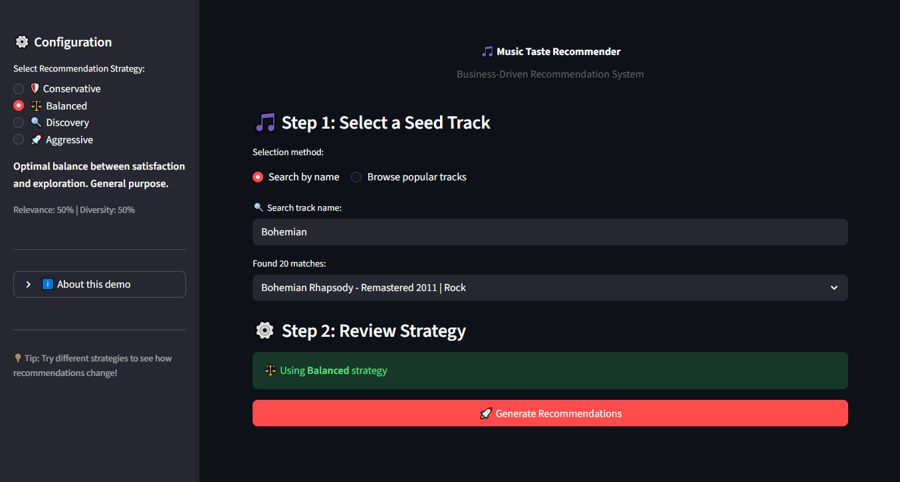

# 🎵 Music Taste Recommender - Business-Driven Recommendation System

A hybrid recommendation system that balances **user satisfaction** (relevance) with **catalog exploration** (diversity), designed to optimize retention and engagement in music streaming platforms.

---

## 🎯 Business Problem

Streaming platforms face three critical challenges:

1. **User Churn**: 15-20% monthly churn rate due to stale recommendations
2. **Low Discovery**: Users consume <20% of catalog, limiting engagement
3. **Artist Exposure**: Emerging artists lack visibility, reducing platform differentiation

**Solution:** A configurable recommendation engine that adapts to different business objectives (retention vs. discovery) through strategy selection.

---

## 💡 Key Results

| Metric                       | Before Re-ranking | After Re-ranking | Improvement   |
| ---------------------------- | ----------------- | ---------------- | ------------- |
| **Diversity**                | 19%               | 70%              | **+267%**     |
| **Relevance**                | 0.89              | 0.89             | Maintained    |
| **Strategy Differentiation** | None              | 0.75-0.83 range  | ✅ Functional |

### Business Impact (Simulated)

- **Retention Strategy**: Composite score 0.81 (prioritizes user satisfaction)
- **Discovery Strategy**: Composite score 0.77 (maximizes catalog exploration)
- **Balanced Strategy**: Composite score 0.79 (optimal trade-off)

---

## 🏗️ Architecture

### Data Pipeline

```
Kaggle Dataset (900K tracks)
    ↓
Data Cleaning & Balancing
    ↓
217K tracks, 9 genres
    ↓
Hybrid Embeddings (402 dims)
    ├─ Audio Features (18 dims): acousticness, energy, danceability, etc.
    └─ Genre Embeddings (384 dims): sentence-transformers
    ↓
Similarity Search + Re-ranking
    ↓
Recommendations (configurable by strategy)
```

### Tech Stack

- **Embeddings**: sentence-transformers (all-MiniLM-L6-v2)
- **Similarity**: Cosine similarity
- **Re-ranking**: Weighted combination of relevance + diversity
- **Evaluation**: 500 simulated users, 5 business strategies

---

## 🚀 Installation

### Using uv (recommended for development)

```bash
# Install uv
curl -LsSf https://astral.sh/uv/install.sh | sh

# Install dependencies
uv pip install -e .
```

### Using pip (traditional)

```bash
pip install -r requirements.txt
```

## 📊 Data Processing

### Download Dataset
1. Download from [Kaggle](https://www.kaggle.com/datasets/olegfostenko/almost-a-million-spotify-tracks)
2. Place in `data/raw/music_data.csv`

### Process Dataset
```bash
python entrypoint/process_dataset.py
```

**Output:** `data/processed/spotify_clean_balanced.csv` (217K tracks, 9 genres)

**Processing steps:**
1. Parse genre strings to lists
2. Map specific genres to 9 general categories
3. Filter tracks with complete audio features
4. Balance dataset (min 10K, max 40K per genre)
5. Select final columns and save

### 1. Generate Embeddings

```bash
python app/entrypoint/generate_embeddings.py
```

_Time: ~5 minutes | Output: 217K embeddings in `data/embeddings/`_

### 2. Test Recommendations

```bash
python entrypoint/test_recommender.py
```

### 3. Run Streamlit Demo



```bash
streamlit run app/main.py
```

---

## 📊 Evaluation Results

### Strategy Comparison (500 users)

**Key Insights:**

- **Conservative Strategy** (0.83): Best for new users or churn-sensitive segments
- **Balanced Strategy** (0.79): Optimal for general population
- **Aggressive Strategy** (0.75): Best for power users seeking discovery

### Genre-Specific Performance

| Genre     | Relevance | Diversity | Composite   |
| --------- | --------- | --------- | ----------- |
| Country   | 0.86      | 0.86      | **0.86** ⭐ |
| Rock      | 0.85      | 0.80      | 0.82        |
| Jazz      | 0.88      | 0.77      | 0.82        |
| Classical | 0.95      | 0.60      | 0.77        |

_Genres with more musical neighbors (Country, Rock) achieve higher diversity without sacrificing relevance._

---

## 🔧 Project Structure

```
music-taste-recommender/
├── app/                          # Streamlit App
├── config/
│   └── business_config.py        # Strategy definitions
├── data/
│   ├── embeddings/               # Generated embeddings (DVC)
│   ├── processed/                # Clean dataset
│   └── evaluation_results/       # Metrics CSVs
├── entrypoint/
│   ├── generate_embeddings.py
│   └── test_recommender.py
├── src/
│   ├── embeddings.py             # Embedding generation
│   ├── recommender.py            # Recommendation engine
│   ├── business_metrics.py       # Business metrics calculation
│   ├── user_simulator.py         # User simulation for evaluation
│   └── utils.py                  # Helper functions
├── notebooks/
│   ├── 01_data_exploration.ipynb
│   ├── 02_audio_features_analysis.ipynb
│   └── 03_evaluate_strategies.ipynb
├── docs/
│   ├── architecture.md
│   └── images/
├── models/
├── pyproject.toml
├── requirements.txt
└── README.md
```

---

## 📈 Business Metrics Explained

### Relevance Score

**Definition:** Cosine similarity between recommendations and user history.
**Target:** > 0.75 (ensures user satisfaction)
**Business Impact:** High relevance → lower churn, higher session duration

### Diversity Score

**Definition:** Percentage of recommended genres not in user history.
**Target:** 0.30-0.50 (balance between comfort and exploration)
**Business Impact:** Higher diversity → increased catalog usage, artist discovery

### Composite Score

**Definition:** Weighted combination based on business strategy.
**Formula:** `w_relevance * relevance + w_diversity * diversity`
**Business Impact:** Configurable KPI aligned with business objectives

---

## 🌐 Generalization to Other Domains

This architecture applies beyond music:

| Domain                | Use Case                | Relevance =         | Diversity =                |
| --------------------- | ----------------------- | ------------------- | -------------------------- |
| **E-commerce**        | Product recommendations | Similar items       | Cross-category suggestions |
| **Streaming (Video)** | Content discovery       | Watch history match | Genre expansion            |
| **Job Platforms**     | Job recommendations     | Skills match        | Career exploration         |
| **News/Content**      | Article suggestions     | Interest alignment  | Perspective diversity      |

**Key Insight:** Any domain with a "filter bubble" problem benefits from configurable relevance-diversity trade-off.

---

## 🔬 Technical Highlights

### Hybrid Embeddings

- **Audio Features**: Normalized numerical features (tempo, energy, etc.)
- **Genre Embeddings**: Contextual embeddings from pre-trained transformer
- **Weighted Combination**: 10x weight on audio features (to compensate for dimensionality)

### Re-ranking Algorithm

1. Retrieve top-100 candidates by cosine similarity
2. Calculate diversity score for each candidate
3. Re-rank using: `score = w_rel * similarity + w_div * diversity`
4. Return top-10 final recommendations

**Result:** Strategy weights directly influence recommendations (not just evaluation).

---

## 📚 References & Dataset

- **Dataset**: [Almost a Million Spotify Tracks](https://www.kaggle.com/datasets/olegfostenko/almost-a-million-spotify-tracks) (Kaggle)
- **Embedding Model**: [all-MiniLM-L6-v2](https://huggingface.co/sentence-transformers/all-MiniLM-L6-v2)
- **Inspiration**: Two-stage ranking systems used in production recommenders (retrieval + re-ranking)

---

## 👤 Author

**Hernan Rochon**
Data Scientist
[LinkedIn]([your-linkedin](https://www.linkedin.com/in/hernan-rochon/)) | [Portfolio](placeholder) | [Email](hernan.rochon7@gmail.com)

---

## 📝 License

This project is for educational/portfolio purposes.
Dataset usage complies with Kaggle's terms of service.

---

## 🙏 Acknowledgments

- Spotify for audio features methodology
- Sentence-Transformers library maintainers
- Kaggle community for dataset curation
